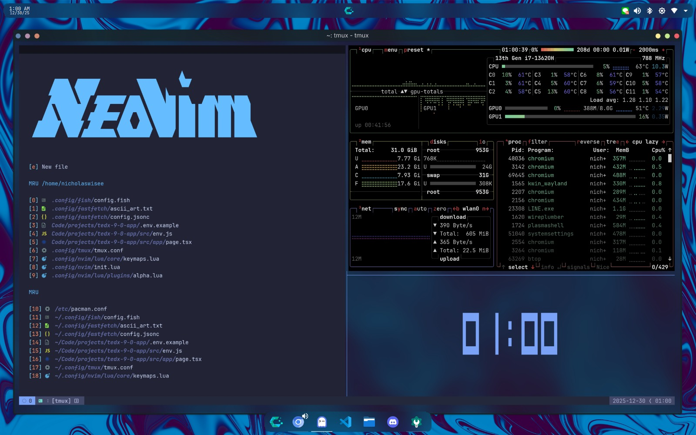

# Dotfiles

Configuration files for my day-to-day dev environment (🤪 My 🤪 Dotfiles 🤪 Gwej 🤪)

## Essential Tools

This repository contains configuration files for:

- **[Fish Shell](fish/)** - go-to, dependable command line shell.
- **[Ghostty](ghostty/)** - my daily-driving terminal, love it.
- **[Neovim](nvim/)** - iUseNeovimBtw
- **[Tmux](tmux/)** - personal settings/keybinds for tmux.
- **[Btop](btop/)** - system resource monitor.
- **[Fastfetch](fastfetch/)** - system info fetcher with custom ascii art.
- **[Lazygit](lazygit/)** - terminal UI for git.
- **[Yazi](yazi/)** - blazing fast terminal file manager.
- **[Rofi](rofi/)** - application launcher with custom keybindings and Tokyo Night theme.

## Others

- My terminal font is JetBrains Mono Nerd Font, and my go-to theme is Tokyo Night.
